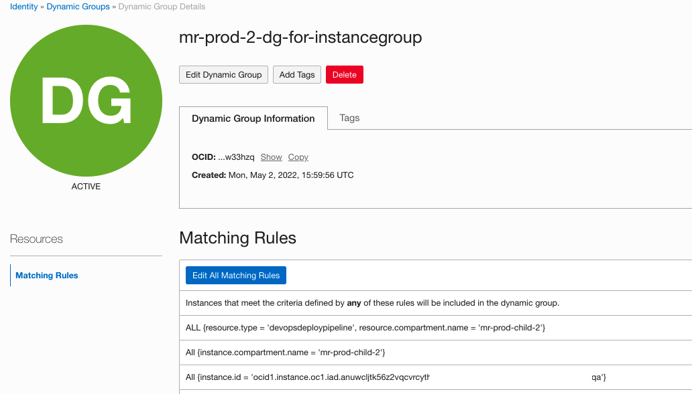
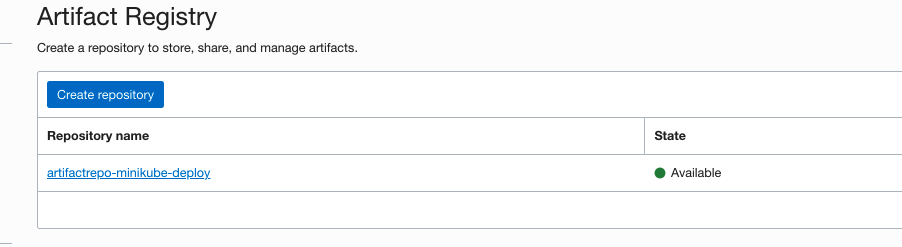
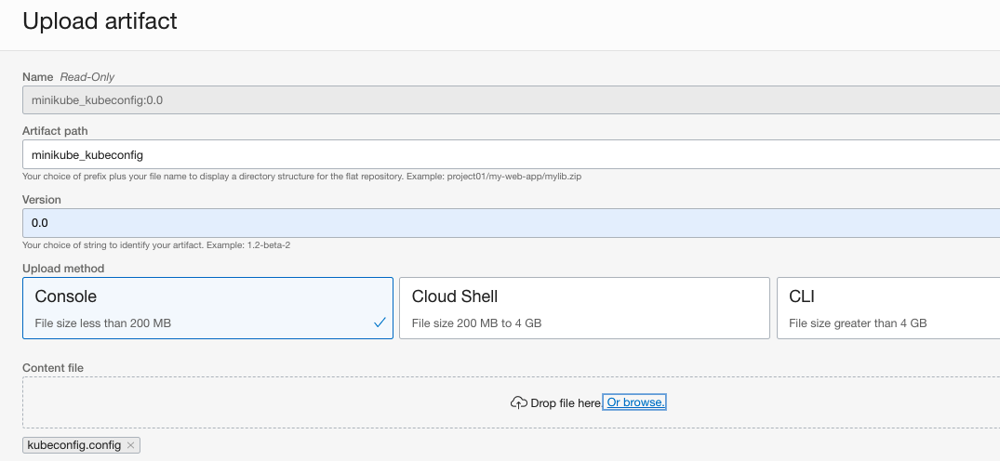

Connect OCI Devops and Minikube using deployment pipeline.

-------------


Objectives
----

- Deploy a single node Minikube on an OCI Compute instance .

- Create an access token for Minikube and store and retrieve via oci vault service.

- Create a OCI Deployment pipeline and invoke a deployment to an OCI VM.

- Use the OCI VM as a jump host to access Minikube cluster.

Audience : Intermediate / Experienced OCI users.

Create an OCI Compute instance
---

- Create an OCI Compute instance - https://docs.oracle.com/en-us/iaas/Content/Compute/home.htm 

- OCI Console > Compute > Instances > Create an instance.


- Use `Oracle Linux 8` as os version and any of the available compute shape .


- Select the networking configuration as accordingly . Select Public subnet if you are planning to add a public IP in the below step.

- Ensure to assign a public IP for the VM to access it via cloud shell. You may use with a Private IP too ,then use an OCI Bastion service to access the VM.


- Use `Show advanced option` > `Management` and enable sudo access to user `ocarun` which will be used by the compute instance agent.

- Select ` Paste cloud-init script` and copy below snippet and `Submit`.

```
#cloud-config
users:
  - default
  - name: ocarun
    sudo: ALL=(ALL) NOPASSWD:ALL

```


- Once the vm is in `RUNNING` stage , check the compute agent status via `Oracle Cloud Agent` tab. Ensure that the agent is `Enabled` and `Running state`


Setup the policies and groups
--------

- OCI Console > `Identity` > Create a new group and associate the OCI Users to it to enable to manage compute agent execution .


- OCI Console > `Identity` > Create a new dynamic group for devops deployment pipeline and compute agent.

- Use below `Rules` for the dynamic groups 

```
ALL {resource.type = 'devopsdeploypipeline', resource.compartment.name = '<COMPARTMENT NAME>'}  
All {instance.id = '<OCID OF THE COMPUTE INSTANCE>'}
```



- OCI Console > `Identity` > Policies > Create a policy and add below statements.

```
Allow group <NAME OF THE USER GROUP > to manage instance-agent-command-family in compartment <NAME OF THE COMPARTMENT>
Allow dynamic-group <NAME OF THE DYNAMIC GROUP> to read secret-family in compartment <NAME OF THE COMPARTMENT>
Allow dynamic-group <NAME OF THE DYNAMIC GROUP> to use ons-topics in compartment <NAME OF THE COMPARTMENT>
Allow dynamic-group <NAME OF THE DYNAMIC GROUP> to use instance-agent-command-execution-family in compartment mr-prod-child-2 where request.instance.id=<OCID of the COMPUTE INSTANCE>
Allow dynamic-group <NAME OF THE DYNAMIC GROUP> to read generic-artifacts in compartment <NAME OF THE COMPARTMENT>
Allow dynamic-group <NAME OF THE DYNAMIC GROUP> to read all-artifacts in compartment <NAME OF THE COMPARTMENT>
Allow dynamic-group <NAME OF THE DYNAMIC GROUP> to read objects in compartment <NAME OF THE COMPARTMENT>
Allow dynamic-group <NAME OF THE DYNAMIC GROUP> to manage objects in compartment mr-prod-child-2

```

Install Minikube
---

- We will be installing Minikube with Podman on Oracle Linux  8 - https://docs.oracle.com/en/learn/ol-minikube/index.html#introduction 

- Login to the vm using user opc - `ssh -i <rsa_privatekey> opc@ipaddress`

- Follow below command sets 

```
$ sudo dnf -y update
$ sudo dnf -y module install container-tools:ol8
$ sudo dnf -y install conntrack
$ sudo dnf -y install curl
$ cd ~; curl -LO https://storage.googleapis.com/minikube/releases/latest/minikube-linux-amd64
$ sudo install minikube-linux-amd64 /usr/local/bin/minikube
$ minikube start --driver=podman
```

- Validate minikube installation and status 

```
$ minikube kubectl -- get pods -A

```


- Run `minikueb ip` and make a note of the IP address.

- Install kubectl cli ,this is only for the local and one time usage to create a token as with minikube kubernetes.You may use a standalone executable of kubectl as well.

```
$ curl -LO "https://dl.k8s.io/release/$(curl -L -s https://dl.k8s.io/release/stable.txt)/bin/linux/amd64/kubectl"
$ chmod +x kubectl
$ mkdir -p ~/.local/bin
$ mv ./kubectl ~/.local/bin/kubectl
$ kubectl get nodes
```


- Create a service user for the Kubernetes 

```
kubectl create serviceaccount miniuser
```

- Bind the user with cluster role previledge , we will be creating a token on this user for cluster access.

```
kubectl create clusterrolebinding miniuser-binding --clusterrole=cluster-admin --serviceaccount=default:miniuser
```


- The above command will create a secrets with user token ,describe the secret and fetch the token.

```
$ kubectl get secrets
$ kubectl describe secret miniuser-token-<KEY>
```
- Make a note of the token.


- Open the current kubeconfig and fetch the certificate too.

```
$ cat ~/.kube/config |grep certificate-authority
$ cat /home/opc/.minikube/ca.crt 
```

- Make a note of the certficate as well .


OCI Vault to Store the credentials
---

- We will be using OCI Vault service to store the token and certificate for kube cluster access . - https://docs.oracle.com/en-us/iaas/Content/KeyManagement/home.htm

- OCI Console > `Identity & Security` >`Vault` - Create a new vault .


- Create a new master key .


- Once they are ready ,create two new secrets and store the values of `minikube token` and `certificate`.


- Make note of the `OCI of VAULT` created. We will be using the same as a parameter for deployment to fetch these information.

OCI Artifactory registry
---

- We will be using oci artifactory registry to store the deployment spec and kubeconfig format (with out values). - https://docs.oracle.com/en-us/iaas/Content/artifacts/home.htm

- OCI Console > `Developer Services` > `Containers & Artifacts` > `Artifactory Registry` and Create a new artifact registry .



- Upload Artifact - with the file `instance_deploymentspec.yaml` with version 0.0 


- Upload another Artifact - with the file `kubeconfig.config` with version 0.0 




OCI Deployment pipeline 
---

- Create an OCI notification topic - https://docs.oracle.com/en-us/iaas/Content/Notification/Tasks/managingtopicsandsubscriptions.htm#createTopic 


- OCI Console  >`Developer Services` > `DevOps`>`Projects` - Create a new project.


- Enable logging for the project .


- Create a devops environment and associate it with the VM created ,under `DevOps project resources` > `Environment`.


- Select the type as `Instance Group` and select the VM information under `Add Instance` .


- Create two `Devops Artifacts` under `DevOps project resources` > `Artifacts`.

- The first one with type `Instance group deployment configuration` .


- Use the source as `Artifactory Registry` and associate with the artifact path and version .


- Create another artifact for `Kubeconfig` and associate the `kubeconfig` artifact references. Use the type as `General artifact`.


- Create a deployment pipeline - under `DevOps project resources` >`Deployment pipelines` 


- Add a deployment stage with type `Deploy Instance Group: Rolling` to the deployment pipeline.


- Associate the devops environment created .


- Select the artifact created  `Deployment spec` as the deployment configuration. 


- We will be adding an optional artifacts ,which is the one created for kubeconfig.


- Click create and created the stage .


- Add two parameters for the deployment pipeline .

```
CLUSTER_IP - Minikube IP
CLUSTER_PORT - PORT for cluster access 
VALUT_OCID  - OCID of the VAULT 
```


Deploy the Application 
---

 - Before we run the application ,let us do a close view of deployment spec steps.

 ```
 steps:
  # This section is to define the scripts that each step shall run on the instance after file copy.
  - stepType: Command
    name: Setup the env
    command: |
      mkdir -p /tmp/kube
      cd  /tmp/kube
      python3 -m pip install --user oci-cli   <== Installing OCI CLI
      export OCI_CLI_AUTH=instance_principal  <== Enabling instance principal auth model for OCI CLI.
      export PATH=$PATH:~/.local/bin/

      curl -LO "https://dl.k8s.io/release/$(curl -L -s https://dl.k8s.io/release/stable.txt)/bin/linux/amd64/kubectl"
      sudo install -o root -g root -m 0755 kubectl /usr/local/bin/kubectl <== Installing kubectl for user ocarun.

      export minikube_token=`oci secrets secret-bundle get-secret-bundle-by-name --secret-name minikube_token --vault-id ${VALUT_OCID}  --stage LATEST|jq '."data"."secret-bundle-content"."content"'|sed 's/"//g'|base64 --decode` <== Reading minikube token from vault and exporting it as a variable.

      oci secrets secret-bundle get-secret-bundle-by-name --secret-name minikube_certificate --vault-id ${VALUT_OCID}  --stage LATEST|jq '."data"."secret-bundle-content"."content"'|sed 's/"//g'|base64 --decode > minikube_certificate.crt <== Fething the certifcate for minikube access 

      cat /tmp/minikube_kubeconfig |envsubst > kube_config <== Replacing the kubeconfig with the values from VAULT and Deployment pipeline parameters 

      export KUBECONFIG="kube_config" <== Setting up the config for kubectl

      kubectl get nodes
      kubectl create deployment hello-node --image=k8s.gcr.io/echoserver:1.4 <== A sample deployment
      kubectl get deployments
      kubectl get pods
      kubectl get events

 ```

- OCI Console > `Developer services` >`DevOps` >`Project` >`Project name` > `Deployment pipeline` - Select `Run pipeline`


- Ensure the parameters are correct and run the deployment.


- Wait for the completion of deployment steps.


- Validate the deployments via deployment logs .


- You may validate the same via minikube cli as well ,by login in to the VM created.

```
$ minikube kubectl get all

```

- You use any of the compatible and reachable kubernetes manifest and registry to deploy applications . You can add them as an optional aritifact and can download to the machine and use them accordingly .

References 
---

- OCI documentation - https://docs.oracle.com/en-us/iaas/Content/services.htm

- Minikube sample deployment - https://kubernetes.io/docs/tutorials/hello-minikube/ 

Contributors 
----

- Author : Rahul M R.
- Collaborators : NA
- Last release : May 2022

